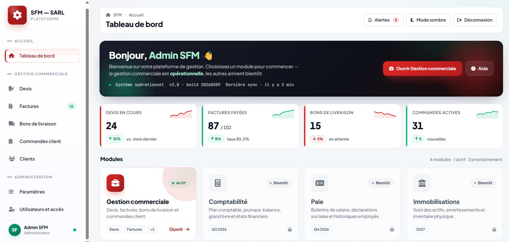

# business-erp-platform
Business ERP platform developed for business process management, including order tracking, quotation management, and workflow organization.
# Business ERP Platform

A web-based ERP platform designed to support business process management and improve the organization of commercial workflows.

## 📌 Overview

The platform provides a centralized interface for managing and monitoring key business processes, including:

* 📦 Order tracking
* 📄 Quotation management
* 🔄 Workflow organization
* 📊 Business process monitoring
* 🗄️ Structured data management

The application was designed to simplify daily operations by centralizing business information and providing an organized workflow for users.

## 🛠️ Technologies Used

| Technology | Purpose                |
| ---------- | ---------------------- |
| PHP        | Backend development    |
| SQL        | Database management    |
| JavaScript | Frontend interactivity |
| HTML/CSS   | User interface         |
| MySQL      | Data storage           |

## ✨ Key Features

### Order Management

* Create and manage orders
* Track order status
* Organize business information
* Monitor the progress of orders

### Quotation Management

* Create and manage quotations
* Organize quotation information
* Track quotation status
* Support the commercial workflow

### Workflow Management

* Centralize business processes
* Organize tasks and information
* Provide a structured workflow for users

## 🖥️ Application Screenshot

### Dashboard

## 🏗️ Architecture

The application follows a web-based architecture consisting of:

**Frontend**

* HTML
* CSS
* JavaScript

**Backend**

* PHP

**Database**

* SQL / MySQL

## 🔐 Confidentiality

This repository is a **portfolio showcase** only.

The original source code, production configuration, credentials, company data, and other confidential technical information are not included.

The screenshots presented in this repository are intended only to demonstrate the application's interface and functionality.

## 🎯 Skills Demonstrated

* Web application development
* PHP backend development
* SQL database management
* JavaScript development
* Business process modeling
* ERP workflow implementation
* Database-driven application design
* User-oriented interface design

## 👩‍💻 Project Role

**Developer**

Designed and developed the application, including backend logic, database integration, business workflows, and frontend functionality.
